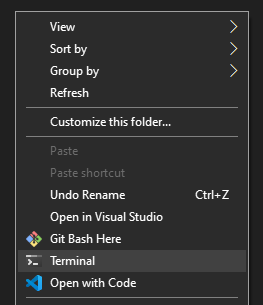

## Add Windows Terminal to the context menus in Explorer

A .reg file to add Windows Terminal (`wt.exe`) to the context menus in Explorer. Uses the `-d %v` commandline argument to start the terminal in the folder you are viewing.

### Instructions

1. Get the output of `echo %localappdata%`, it will be something like `C:\Users\xyz\AppData\Local`
2. Replace the occurances of `%localappdata%` in the `.reg` file with the proper string from above ensuring that backslashes are properly escaped (`\` -> `\\`).
3. Run the `.reg` file.

### Troubleshooting

If the location of your `wt.exe` is not where mine was (because MS has changed it) then edit the paths accordingly. Same goes for the `.ico`.

### Additional Info

You can change the text from `Terminal` to whatever you want, like `Start Terminal here...`, by adjusting the `@="Terminal"` lines, and replacing `Terminal` with the text you want.
